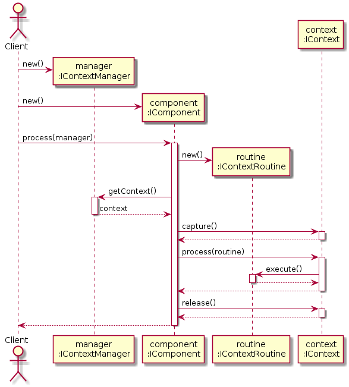

# Architecture Description Language

## Basic example

### ADL code:
```
interface IContextRoutine {
    void execute();
}

interface IContext {
    void capture();
    void process(IContextRoutine routine);
    void release();
}

interface IContextManager {
    IContext getContext();
}

interface IComponent {
    void process(IContextManager manager);
}

behavior {

    IContextManager manager;
    IComponent component;
    component.process(manager) {
        IContextRoutine routine;

        IContext context = manager.getContext();
        context.capture();

        context.process(routine) {
            routine.execute();
        };

        context.release();
    };

}
```

### Result diagram


## Types checking

### Unknown types
```
interface A {
    B foo(); // Error: Unknown return type B at line 2
}
```
```
behaviour {
    A var; // Error: Unknown variable type A at line 2
}
```

### Unknown calls
```
interface A {
    void foo();
}

interface B {
    void bar(A a);
}

behavior {
    A var;
    va.foo(); // Error: Unknown variable va at line 11
    var.fooo(); // Error: Unknown method fooo from A at line 12

    B boo;
    boo.bar(va); // Error: Unknown variable va in arguments list at line 15
}
```

### Types mismatch
```
interface A {
    void foo();
}

interface B {
    void bar(A a);
}

behavior {
    A var;
    B boo;
    boo.bar(); // Error: Arguments number mismatch for method bar at line 12
    boo.bar(var, var); // Error: Arguments number mismatch for method bar at line 13
    boo.bar(boo); // Error: Cannot cast variable boo of type B to type A at line 14
    A foo = boo.bar(var); // Error: Cannot cast return type void to type A at line 15
}
```